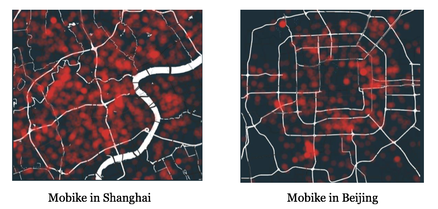

# Mobike Hotspot Detection

> Detecting mobike hotspots in new cities by city domain adaptation model.

Tensorflow implementation for the paper **'Where Will Dockless Shared Bikes be Stacked? — Parking Hotspots Detection in a New City'**, which is publised on the applied data science track of KDD 2018 (The 24th ACM SIGKDD International Conference on Knowledge Discovery & Data Mining). 

We aim at transferring knowlege from the city popular with dockess shared bike to the new cities and detecting potential hotspots roads before expanding to these cities.




## DataSet

We collect muliple geo-related data from differet sources, including:
 
 * Mobike data (by crawler);
 * POI data from ([Baidu Map](http://lbsyun.baidu.com)); 
 * Satellite light ([Light Polution](https://www.lightpollutionmap.info));  
 * Road network ([OpenStreetMap](https://openstreetmap.org));
 * Transportation hubs (collect manually);
 * Business centers ([Fliggy](https://www.fliggy.com));

If you're interested in these data, you can refer to the `data/meta_data` folder, we provide the part of the preprocessed **subway station, business center, satellite light cluster results data** from Shanghai, Beijing, and Ningbo three cities. You can also crawl more data from our provided sources.


## Project Structure

The project is organized as follows: 
	
```
data/
	meta_data: multiple source data;
	road/
		train_bound: data version for feed forward neural network;
		train_bound_cnn: data version for convolutional network;
metrics/
	the maximum mean discrepancy metric implementation
models/
	core models and run scripts
results/
	the spatial-temporal characteristics analysis results
road_match/
	map matching and feature extraction scripts
util/
	general common functions
```

## Citation

If you use this code or the data for your research, please cite our paper, [paper link](https://dl.acm.org/citation.cfm?id=3219920):

```
@inproceedings{Liu2018Where,
  title={Where Will Dockless Shared Bikes be Stacked? — Parking Hotspots Detection in a New City},
  author={Liu, Zhaoyang and Shen, Yanyan and Zhu, Yanmin},
  booktitle={The 24th ACM SIGKDD International Conference on Knowledge Discovery & Data Mining},
  pages={378-386},
  year={2018},
}
```

## Reference
1. Our previous work on dockless shared bike distribution inferences, [paper link](http://delivery.acm.org/10.1145/3160000/3159708/p378-liu.pdf?ip=58.196.134.62&id=3159708&acc=ACTIVE%20SERVICE&key=BF85BBA5741FDC6E%2E17676C47DFB149BF%2E4D4702B0C3E38B35%2E4D4702B0C3E38B35&__acm__=1528063105_1c4cb13b6ecdb7cf567e551a8aea900c):

	```
	@inproceedings{Liu2018Inferring,
	  title={Inferring Dockless Shared Bike Distribution in New Cities},
	  author={Liu, Zhaoyang and Shen, Yanyan and Zhu, Yanmin},
	  booktitle={Eleventh ACM International Conference on Web Search and Data Mining},
	  pages={378-386},
	  year={2018},
	}
	```

2. Bike lane planning work in KDD 2017, [paper link](https://www.microsoft.com/en-us/research/wp-content/uploads/2017/06/main-1.pdf):

	```
	@inproceedings{Bao2017Planning,
	  title={Planning Bike Lanes based on Sharing-Bikes' Trajectories},
	  author={Bao, Jie and He, Tianfu and Ruan, Sijie and Li, Yanhua and Zheng, Yu},
	  booktitle={ACM SIGKDD International Conference on Knowledge Discovery and Data Mining},
	  pages={1377-1386},
	  year={2017},
	}
	```

3. Unsupervised Domain Adaptation by Backpropagation, [paper link](http://proceedings.mlr.press/v37/ganin15.pdf):

	```
	@article{Ganin2014Unsupervised,
	  title={Unsupervised Domain Adaptation by Backpropagation},
	  author={Ganin, Yaroslav and Lempitsky, Victor},
	  pages={1180-1189},
	  year={2014},
	}
	```


## License

1. For academic and non-commercial use only.
2. For commercial use, please contact [Mobike Company](https://mobike.com/cn/)
    
    
